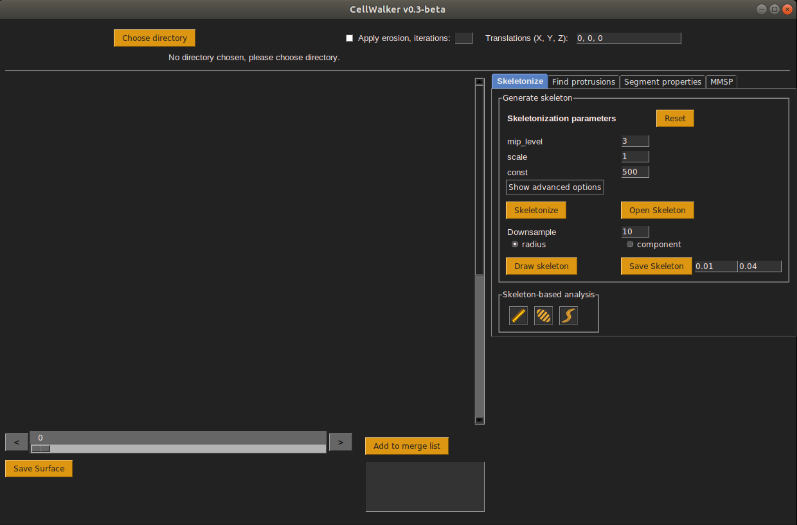
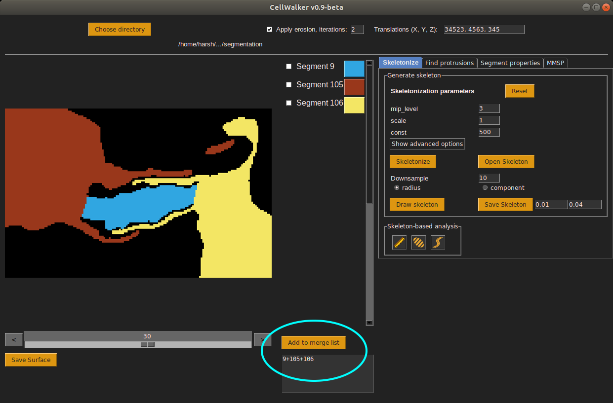
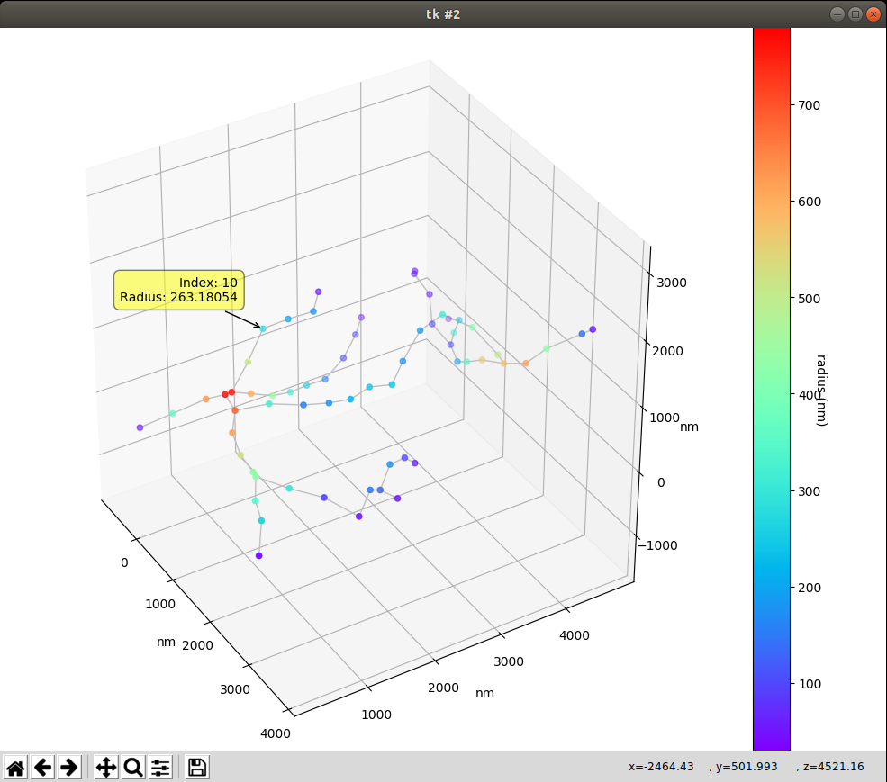

# CellWalker

Morphological analysis tool for segmented 3D microscopy images of biological cells 

### Installation

This program does not require specific installation procedure. The script is tested on Python 3.6 on Ubuntu 18.04.

## User guide<br>

**Versions**
The latest version is 'cellwalker_v0.9-beta.py' and can be found in the 'src' folder in the repository. It is recommended to use this version for availability of the most updated tools.

**Setting up python environment**
The CellWalker setup was tested using <a href="https://www.anaconda.com/" target="_blank">Anaconda Python</a> distribution. But it should be possible to use other python distributions as well.<br><br>

Clone the github repository to your local system and browse to the downloaded folder from a command line (for linux) or using Anaconda Prompt (for windows)

Create an environment with Python 3.6.
```
conda create --name cellwalker python=3.6
```

Activate the newly created environment
```
conda activate cellwalker
```

Install dependencies using requirements.txt file.
```
pip install -r requirements.txt
```

Browse to the 'src' folder of the cloned repository and run the python script as follows.
```
python cellwalker_v0.9-beta.py
```
The above command will launch the CellWalker window as shown below.
<p style="font-style: italics;" align="center">
<br>
CellWalker window
</p>

All functionalities of CellWalker are accessible through this single window. The left hand side panel of the window displays the loaded image stack, while all the analytical functions are accessible from the tabbed panel on the right hand side. Each tab in this panel is named accordingly. For examplem, the tab named **Skeletonize** contains all the functions related to skeletonization of 3D objects, such as- building, saving and opening skeletons, measurements on the skeletons etc.

**Global parameters**
   1. Translations (X, Y, Z): In most cases, only a cropped version of the segmented images is loaded in the CellWalker for analysis so that the loaded images consume less memory. This, however, introduces a mismatch in the origin coordinates for the loaded images with respect to the original images. It is therefore necessary to tell CellWalker how much it needs to shift the origin so as to align the coordinates of the loaded images with the original image stack. These translation coordinates are used while exporting images/3D objects/other coordinate files. For example, when 3D objects are exported the translation coordinates are applied to the calculated coordinates so that the 3D objects have correct location in space.
   2. Apply erosion, iterations: This input is designed to decide whether the segmented objects are eroded (thinned) before processing. If you select the checkbox on the left, the 3D image erosion of the segments will be turned on. The textbox on the right is then used to specify the amount of erosion required in terms of erosion iterations. Please find more information about image erosion <a href="https://docs.scipy.org/doc/scipy-0.14.0/reference/generated/scipy.ndimage.morphology.binary_erosion.html" target="_blank">here</a>.


**Loading segmented images (or segmentation masks)**
1. Click on the 'Load segmentation' button.
2. A dialog box will open and allow selection of a folder.
3. Browse to the folder that contains the segmentation stored as images in PNG format.
At the moment, CellWalker can only read PNG image sequences. If you have a tiff image stack then you can use a software like ImageJ to generate an image sequence.
Also please note that the current version of CellWalker is designed to work with 8-bit grayscale segmentation images. If 24-bit RGB images are provided, then only the first channel will be used to detect segment labels.
4. Once inside the folder containing the images, click 'Ok'. A dialog box will popup asking if you want to continue loading the images. If you are certain that this is the folder you want to choose, click 'Ok'. Otherwise click 'Cancel'. Note that large image sequences can take considerably long time to load into CellWalker.
5. The images will now be loaded and the CellWalker will display the sequence of images in the segmentation frame. The colors assigned to the segments will be arbitrary. The segments identified by the CellWalker will be listed in the panel on the right side of the segmentation frame. The labels for the segments are derived from the actual pixel values. For example, a segment named 'Segment 121' is the segment with pixel values 121 in the original image.
The displayed colors of a segment can be changed by clicking on the colored button against the name of the segment.
6. Scrolling throught the image sequence is facilitated by the slider at the bottom of the segmentation frame. Scrolling is also possible using keyboard left and right arrows after clicking once on any segmentation image.

<p style="font-style: italics;" align="center">
<br>
CellWalker window
</p>

**Skeletonization of selected segments**<br>
1. Skeletonization requires segments to be selected. To do so, select required segments by clicking on the checkboxes against their labels and click on the 'Add to merge list' button. The segment labels added to a merge list will be treated as a single label for skeletonization purpose. Using merge list gives flexibility of choosing various combinations of segments which is very useful when the loaded segmentation contains a large number of segments.
<p style="font-style: italics;" align="center">
<br>
Create 'merge list' of the selected segments
</p>
2. Now choose the 'Skeletonization' tab from the right-hand panel. This tab contains two sub-sections- 'Generate skeleton' and 'Skeleton-based analysis'.
3. Skeletonization is performed using the <a href="https://github.com/seung-lab/kimimaro" target="_blank">Kimimaro method</a>. The skeletonization parameters shown in CellWalker are those that are required by the Kimimaro skeletonization library. The default parameters usually work well, however tweaking of the default values may be necessary to get the best output.
4. The mip_level parameter defines the voxel anisotropy. Please refer to the following mip level table to choose from the available anisotropy values.
<table>
	<tr><td>mip_level</td><td>X, Y, Z</td></tr>
	<tr><td>none</td><td>1, 1, 1</td></tr>
	<tr><td>0</td><td>4, 4, 30</td></tr>
	<tr><td>1</td><td>8, 8, 30</td></tr>
	<tr><td>2</td><td>16, 16, 30</td></tr>
	<tr><td>3</td><td>32, 32, 30</td></tr>
	<tr><td>4</td><td>64, 64, 30</td></tr>
	<tr><td>5</td><td>128, 128, 30</td></tr>
	<tr><td>6</td><td>256, 256, 30</td></tr>
	<tr><td>7</td><td>512, 512, 30</td></tr>
</table>
5. The advanced parameters for Kimimaro may be accessed using the 'Show advanced options' button.<br>
6. Once the parameters are set, click on the 'Skeletonize' button. The button will remain deactivated while the skeletonization is running.<br>
7. When the skeletonization is over, you can draw the skeleton using the 'Draw skeleton' button.<br>
8. If a downsampling parameter is set in the 'Downsample' inputbox, the skeleton will be shown at a reduced resolution based on the value of the downsampling parameter. Higher the downsampling, lower the number of nodes in the skeleton. This is particularly useful for reducing the complexity while viewing large and dense skeletons.<br>
9. There is also an option of coloring the skeleton by the node radius or the component. Coloring using node radius values is useful to visually contrast between thicker and thinner regions of the 3D object. On the other hand, coloring by component can give an idea of disconnected objects where skeleton was separately built for each object.<br>
10. The 'Draw skeleton' button will launch a 3D viewer (as implemented in the cloud-volume package) showing the skeleton as nodes connected by edges. The color scale on the right will indicate the node radius if the radius was chosen as coloring method.<br>
<p style="font-style: italics;" align="center">
<br>
Skeleton viewer
</p>
11. Hold and drag mouse left button to rotate the scene. Hold and drag mouse right button to zoom in/out.<br>
12. The 'Save skeleton' button will open a dialogbox with a suggested filename for saving the skeleton. You can either accept the suggested name (that contains the information of the parameters used for skeletonization) or type another name. The extension of the file has to be 'swc'. The skeleton is then saved in the SWC format. Additionally, CellWalker will also save an OBJ and an MTL file for the skeleton. The OBJ and MTL files can be used to load a 3D representation of the skeleton in software like <a href="" target="_blank">Blender</a> for advanced visualization.<br>Note that translation coordinates will be applied to the skeleton saved as OBJ file.<br>
13. Skeletons can also be opened from the SWC files using the 'Open skeleton' button.<br><br>

**Skeleton-based analysis**<br>
1. Once the skeleton is visualized, you can perform the following analyses by selecting the nodes on the skeleton and then choosing an action from the 'Skeleton-based analysis' section. These action buttons present an icon and show a tooltip by hovering the mouse cursor to describe the action they perform.
2. The nodes on the skeleton can be chosen by pressing the mouse middle button. The selected node ids are printed in the terminal window.
3. 'Calculate length': Select two nodes and then click on the button with a ruler icon. The button shows 'Calculate length' as tooptip. The length calculations will be printed to the terminal window. The straight length as well as the path length are calculated between the two selected nodes. For the path length, the full path is also printed as a table showing details of the shortest path between the selected nodes.<br>
4. 'Create cross-sections': This function is meant for creating the cross-sections of the original image volume (not the segmented image volume) and generate histogram of intensities along in a chosen direction. The original images should be placed in a folder named 'EM' alongside the folder from which the segmented images were loaded. To perform cross-section analysis, select two nodes on the skeleton to denote the direction in which you want CellWalker to cut the 3D image volume. CellWalker will use coordinates of these two nodes to create a 'centerline'. The cross-sectioning will be performed perpendicular to this line. Two files are created- centerline.obj and centerline-histogram_selected-labels-<label id>.csv. The CSV file contains the histogram data for normalized intensity calculations. All intensity values of the voxels are inverted, so that higher values correspond to darker regions in the ssSEM images. This design choice is made to facilitate the interpretation of our measurements of cytoskeletal density, since in this case the elements of interest are electron-dense. The intensities are min-max scaled and normalized by the volume of the cross-section.<br>
5. 'Calculate curvature': Curvature of the sub-skeleton delimited by the two selected nodes can be calculated using the 'Calculate curvature' button. The curvature calculations are saved as a CSV file in a chosen folder. The file contains information as follows-<br><br>
Sum-of-orthogonal-distances: Sum of orthogonal distances of all the nodes along the sub-skeleton from the best fit line obtained by orthogonal distance regression.<br><br>
Avg-of-orthogonal-distances: Average of orthogonal distances of all the nodes along the sub-skeleton from the best fit line obtained by orthogonal distance regression.<br><br>
Std-of-orthogonal-distances: Standard deviation of orthogonal distances of all the nodes along the sub-skeleton from the best fit line obtained by orthogonal distance regression.<br><br>
Avg-of-curvature: Average Menger curvature (described in the figure below)<br><br>
Std-of-curvature: Standard deviation of Menger curvature (described in the figure below)<br><br>
Avg-of-angle: Average angle subetended at the non-terminal nodes along the subskeleton by the terminal nodes.<br><br>
Std-of-angle: Standard deviation of angle subetended at the non-terminal nodes along the subskeleton by the terminal nodes.<br><br>
R-squared_least-square-regression: R-squared value of the best fit line through the nodes of the sub-sekeleton using linear least squares method.<br><br>
Table with following columns to provide detailed information at each node in the sub-skeleton<br><br>
Node_ID,X,Y,Z,Orthogonal_distance,Curvature,Angle<br><br><br>
	
	
To find features of cross-sections, you have to use the provided python script after loading the OBJ file of the object in Blender.<br>
Start Blender and and import the OBJ file. Remember to set axes to Y-forward and Z-up if you are using OBJ files exported from the VAST software. VAST inverts the axes by default so you have to invert them back to get correct sense. (Although, keeping any sense, mirrored or otherwise, does not affect the numerical values of intrinsic calculations such as distances, areas, volumes etc.).<br>
Once the object is loaded, you can see it on the screen. The objects position will likely not be the origin of the Blender's scene. To center your viewport on the object, select the object in the right-hand side panel, bring the mouse cursor in the viewport and press "." (dot) on the num pad of your keyboard.<br>

To perform cross-sectioning and calculation of cross-section features, you can now use the python script provided in this repository.<br>
Click on the Scripting tab on the top. Blender screen will be reorganized to run the scripts. You can adjust the sizes of the subpanels as you like.<br>
Now load the object for the centerline (centerline.obj) which you had exported from the CellWalker. This is the guide line to perform cross-sectioning. If the correct translations have been provided to CellWalker before exporting centerline object, then the loaded centerline should appear going through the center of the loaded object (assuming that the segmentation of the same object was used to create centerline in CellWalker).<br>

Now save this Blender state as a .blend file. Saving it in a specific location allows the further calculations and exports to take place in the same folder as the saved .blend file.<br>

You have to edit the script at one place to point it to the cellwalker environment which you created in the beginning.<br>
Open the script '?' in any text editor. Locate the line that starts with 'sys.path.append("...'. In the double quotes you will see a path to the site-packages folder inside the 'cellwalker' environment. Type a similar path on your computer. Save the file and close the text editor. Now the script can find required packages for performing cross-section analysis.<br>

Now back in Blender GUI, select the object which you want to cross-section.<br>

Then, in the Console panel in the Blender's GUI, type the command and press Enter button.
```
python <path to the script>/scriptname.py
```

The script will run on the selected object. It will also automatically check if the centerline is present. Note that the object named 'centerline' must be present for correct execution of this script.

A collection of cross-sections will be created in the right-hand side panel. At the same time, the calculated parameters will be exported to a file named-
```
<object name>_cross-section_param.csv
```
The exported file lists features calculated for all cross-sections in a CSV format.<br><br>

**Saving segments as 3D objects-**
Saving selected segments as .OBJ files is facilitated by the 'Save surfaces' button at the bottom right corner of the CellWalker interface. It exports the selected labels as 3D .OBJ files that can be used by CellWalker and also many other 3D graphics programs such as Blender and 3DsMax.<br>

**Find protrusions**<br>
This is function is provided in the 'Find protrusions' tab in the CellWalker interface.<br>
Protrusions are projections on the surface of the soma of a cell. The protrusions are considerably thinner than the soma of the cell. This morphological feature of the protrusions is used to identify them with morphological modifiers. The algorithm used here is an erosion-dilation method. The object is eroded for a fixed number of iterations so that the thinner parts are shaved off. Then a dilation operation is performed for the same or more number of itarations to reproduce an approximate original object which does not have any thinner protrusions.
The protrusions are then given by subtracting the dilated object (object D) from the original object (Object O).<br>
The soma is calculated by subtracting the protrusions from the original object (Object O).<br>
The number of iterations of erosion should be less than the number of iterations of dilation for appropriate results. The fine tuning of the exact number of iterations might require a few trials. However, the recommended numbers (10 for erosion and 30 for dilation) work for most cases.<br>
The output is saved as .OBJ files for both soma and protrusions.

**Segment propertise**<br>
This function is provided in the 'Segment properties' tab in the CellWalker interface.<br>
Segment properties such as surface area, volume, dimensions etc are useful for morphometric analysis. The output of the calculated segment properties is saved in the user-provided output file.<br>

**Calculate planes separating selected objects**<br>
The plane of separation of two objects might be useful to describe their orientation with each other.
For this purpose a functionality is provided under MMSP (Maximum Margin Separation Plane) tab in the CellWalker interface. 
This function does not depend on the loaded segmenataion. It requires objects stored in OBJ format. You may use the 'Save surface' button in the CellWalker interface or you can also use OBJ files obtained using any other programs.<br>
The calculation of MMSP between two objects might take several minutes for large objects. To reduce the time by compromizing on accuracy, an option of using only certain percentage of vertices is also provided.<br>
The MMSP is calculated using Support Vector Machines (SVM) to obtain a best fit plane that separates the two objects (i.e. vertices of the two objects).<br>
The output file of MMSP calculation provides detailed description of the two objects, the MMSP and the orientation of the two object with respect to the MMSP.<br>

<hr>

## Common errors and post-installation adjustments

**If you get error- 'No module named google', install following package.**<br>
```
pip install google-cloud-storage
```

**For better looking fonts on Anaconda installed on Linux**<br>
Note: This is NOT a guaranted way of making Tkinter fonts look better on Anaconda installed on a linux system. Please make sure that you create a conda environment and take backup of original library files before experimenting.<br>
Taken from- https://stackoverflow.com/questions/47769187/make-anacondas-tkinter-aware-of-system-fonts-or-install-new-fonts-for-anaconda?noredirect=1&lq=1<br>
1. Take backup of /home/<username>/anaconda3/lib/libtk8.6.so
2. Create symbolic link to systems libtk8.6.so which is built on FreeType fonts.
```
ln -s /usr/lib/x86_64-linux-gnu/libtk8.6.so /home/<username>/anaconda3/lib/libtk8.6.so
```
(Note: Install libtk8.6 (or whichever version) if not found in system's library.)<br>

Tk shipped with anaconda might require exact version of the libtk library.<br>
For example, it might ask for 8.6.8 version exactly. This version of libtk might not be available in the system's library.<br>
In such a case, download the libtk8.6.so for that version and replace Anaconda's libtk8.6.so with this new file.<br>

Alternatively, libtk8.6.8.so can also be extracted from the libtk deb package.<br>
Go to http://archive.ubuntu.com/ubuntu/pool/main/t/tk8.6/ and find the required version of libtk installation package.<br>
In this case, it is libtk8.6_8.6.8-4_amd64.deb<br>
Download libtk8.6_8.6.8-4_amd64.deb<br>
Open the downloaded deb file with archive manager (or any other extracter).<br>
Find the required libtk8.6.so file. It is usually located in data/usr/lib/x86_64-linux-gnu folder.<br>
Replace Anaconda's libtk8.6.so with this new file.<br>

