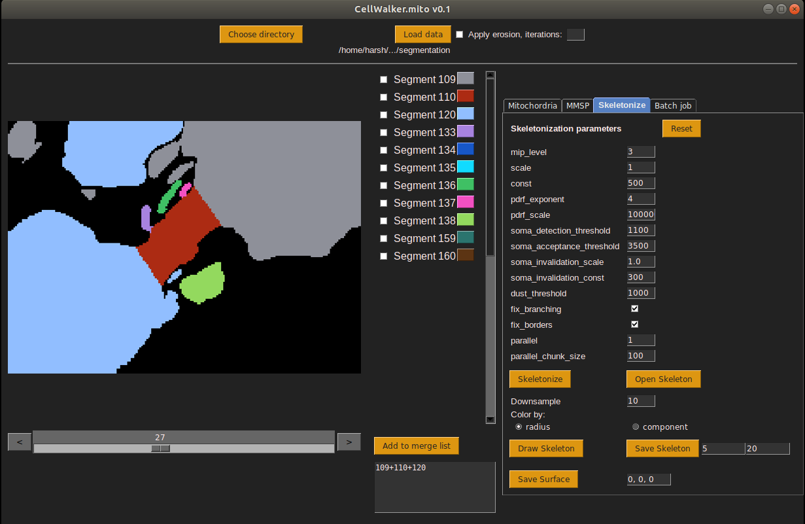

# CellWalker
Morphological analysis tool for segmented 3D microscopy images of biological cells

### Installation

This program does not require specific installation procedure. The script is tested on Python 3.7 on Ubuntu 18.04.

If you prefer to create the python environment yourself, then please refer to the required packages the requirements.txt file. Otherwise, just follow the procedure given in the user guide below.


## User guide<br>
Under progress

Clone the github repository to your local system and browse to the downloaded folder from a command line (for linux) or using Anaconda Prompt (for windows)

Create python environment using the provided .yml file. This step is tested using Anaconda Python distribution (link). But it should be possible to use other python distributions as well.
```
conda env create -f cellwalker.yml
```

Activate the newly created environment
```
conda activate cellwalker
```

Browse to the 'src' folder of the cloned repository and run the python script as follows
```
python cellwalker.py
```
The above command will launch the CellWalker window as shown below.
<p style="font-style: italics;" align="center">
<br>
CellWalker window
</p>

All functionalities of CellWalker are accessible through this single window. The left hand side panel of the window displays the loaded image stack, while all the analytical functions are accessible from the tabbed panel on the right hand side. Each tab in this panel is named accordingly. For examplem, the tab named **Skeletonize** contains all the functions related to skeletonization of 3D objects, such as- building, saving and opening skeletons, measurements on the skeletons etc.

**Global parameters**
   1. Translation coordinates: In most cases, only a cropped version of the segmented images is loaded in the CellWalker for analysis so that the loaded images consume less memory. This, however, introduces a mismatch in the origin coordinates for the loaded images with respect to the original images. It is therefore necessary to tell CellWalker how much it needs to shift the origin so as to align the coordinates of the loaded images with the original image stack. These translation coordinates are used while exporting images/3D objects/other coordinate files. For example, when 3D objects are exported the translation coordinates are applied to the calculated coordinates so that the 3D objects have correct location in space.


**Loading segmented images (or segmentation masks)**
1. Click on the 'Load segmentation' button.
2. A dialog box will open and allow selection of a folder.
3. Browse to the folder that contains the segmentation stored as images in PNG format.
At the moment, CellWalker can only read PNG image sequences. If you have a tiff image stack then you can use a software like ImageJ to generate an image sequence.
Also please note that the current version of CellWalker is designed to work with 8-bit grayscale segmentation images. If 24-bit RGB images are provided, then only the first channel will be used to detect segment labels.
4. Once inside the folder containing the images, click 'Ok'. A dialog box will popup asking if you want to continue loading the images. If you are certain that this is the folder you want to choose, click 'Ok'. Otherwise click 'Cancel'. Note that large image sequences can take considerably long time to load into CellWalker.
5. The images will now be loaded and the CellWalker will display the sequence of images in the segmentation frame. The colors assigned to the segments will be arbitrary. The segments identified by the CellWalker will be listed in the panel on the right side of the segmentation frame. The labels for the segments are derived from the actual pixel values. For example, a segment named 'Segment 121' is the segment with pixel values 121 in the original image.
The displayed colors of a segment can be changed by clicking on the colored button against the name of the segment.
6. Scrolling throught the image sequence is facilitated by the slider at the bottom of the segmentation frame. Scrolling is also possible using keyboard left and right arrows after clicking once on any segmentation image.

<p style="font-style: italics;" align="center">
<br>
CellWalker window
</p>

**Using 'Merge List' and saving segments as 3D objects-**

Skeletonization-

Using translation coordinates

Using erosion

Kimimaro parameters

Opening skeletons from SWC files

Viewing skeletons- downsampling, coloring by node radius / component, zoom, pan

Analysis of skeletons-
   1. Selecting nodes on skeleton
   2. Length measurement between two nodes
   3. Cross-sectioning of original images using skeleton- Using EM data and masks
   4. Curvature analysis

Saving skeletons as SWC and OBJ files
   1. Setting radius for edges and nodes
   


Find protrusions
   1. Deciding erosion and dilation iterations
   2. Output obj files - soma, protrusions

Segment propertise: Morphometric analysis of segments

Calculate planes separating selected objects


## Common errors and post-installation adjustments

**For error 'No module named google' do the following**<br>
```
pip install google-cloud-storage
```

**For better looking fonts follow these instructions**
Taken from- https://stackoverflow.com/questions/47769187/make-anacondas-tkinter-aware-of-system-fonts-or-install-new-fonts-for-anaconda?noredirect=1&lq=1<br>
1. Take backup of /home/<username>/anaconda3/lib/libtk8.6.so
2. Create symbolic link to systems libtk8.6.so which is built on FreeType fonts.
```
ln -s /usr/lib/x86_64-linux-gnu/libtk8.6.so /home/<username>/anaconda3/lib/libtk8.6.so
```
(Note: Install libtk8.6 (or whichever version) if not found in system's library.)<br>

Tk shipped with anaconda might require exact version of the libtk library.<br>
For example, it might ask for 8.6.8 version exactly. This might not be available in the system's library.
In such a case, download the libtk8.6.so for that version.
libtk8.6.8.so can also be extracted from the libtk deb package.<br>
Example, dowonload http://archive.ubuntu.com/ubuntu/pool/main/t/tk8.6/libtk8.6_8.6.8-4_amd64.deb<br>
Open with archive manager (or any other extracter).<br>
Find the required libtk8.6.so file and replace anaconda's libtk8.6.so with this new file.<br>

